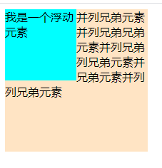

# BFC

## 什么是BFC

BFC（Block Formatting Context），块级格式上下文，是W3C规范中的一个概念，可以说是一套渲染规则，它决定了其子元素如何定位，以及和周围其他元素的关系

## 触发条件

* body标签本身具有bfc特性
* 浮动元素，float除none以外的值
* 绝对定位元素，position（absolute，fixed）
* display为inline-block，table-cells，flex，grid
* overflow（hidden，auto，scroll）

## 渲染规则

* 同一bfc容易下的两个元素垂直方向边距会重叠（取大值）
* bfc元素可以包含浮动元素（清除浮动）
* bfc是一个独立的容器，里面元素和外面元素不会相互影响

## 应用场景

1. 解决body元素下兄弟元素垂直外边距发生折叠

```html
<style>
  div{
    width: 100px;
    height: 100px;
    background: lightblue;
    margin: 100px;
  }
</style>

<body>
    <div></div>
    <div></div>
</body>
```

改为

```html
<style>
  .container {
      overflow: hidden;
  }
  p {
      width: 100px;
      height: 100px;
      background: lightblue;
      margin: 100px;
  }
</style>
<body>
    <div class="container">
        <p></p>
    </div>
    <div class="container">
        <p></p>
    </div>
</body>
```

2.防止浮动导致父元素高度塌陷（清除浮动）

```html
<style>
  .container {
    border: 10px solid red;
  }
  .inner {
    background: #08BDEB;
    height: 100px;
    width: 100px;
  }
</style>

<body>
  <div class="container">
    <div class="inner"></div>
  </div>
</body>
```

改为

```html
<style>
  .container {
    overflow: hidden;
    border: 10px solid red;
  }
  .inner {
    float: left;
    background: #08BDEB;
    height: 100px;
    width: 100px;
  }
</style>

<body>
  <div class="container">
    <div class="inner"></div>
  </div>
</body>

```

3.阻止元素被浮动元素覆盖

```html

<style>
  .float {
    float: left;
    width: 100px;
    height: 100px;
    background-color: aqua;
  }
  .brother {
    width: 200px;
    height: 200px;
    background-color: bisque;
  }
</style>
<body>
  <div class="float">我是一个浮动元素</div>
  <div class="brother">并列兄弟元素并列兄弟兄弟元素并列兄弟列兄弟元素并兄弟元素并列列兄弟元素</div>
</body>

```

改为

```html

<style>
  .float {
    float: left;
    width: 100px;
    height: 100px;
    background-color: aqua;
  }
  .brother {
    overflow: hidden;
    width: 200px;
    height: 200px;
    background-color: bisque;
  }
</style>
<body>
  <div class="float">我是一个浮动元素</div>
  <div class="brother">并列兄弟元素并列兄弟兄弟元素并列兄弟列兄弟元素并兄弟元素并列列兄弟元素</div>
</body>

```

效果



