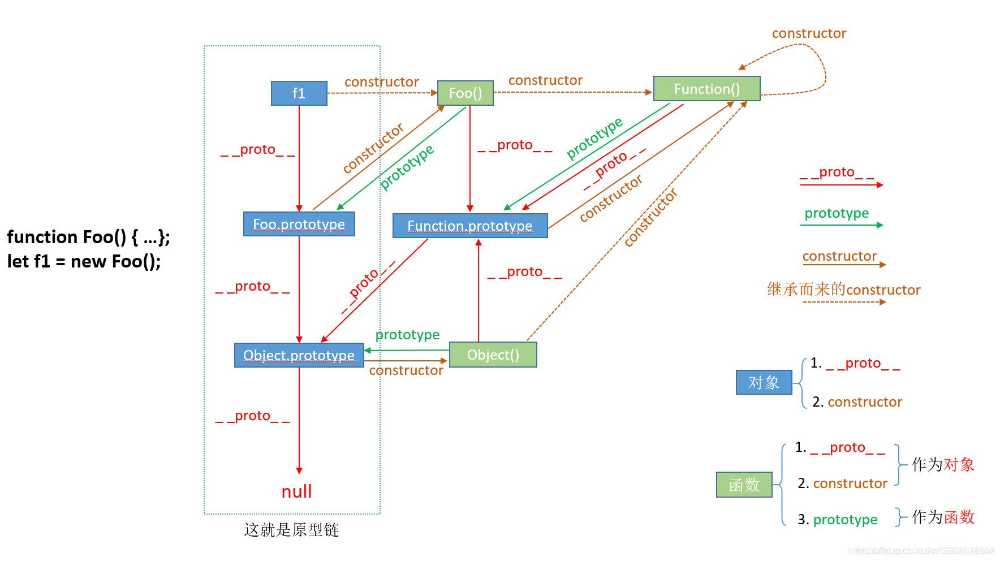

# 原型

## 基本概念

* 所以函数是对象的一种

* prototype是函数中的一个属性，它指向通过这个函数生成对象的一个共有祖先,是可以被改变的，他和constructor是成对相反的

* Parent.prototyp 里面放的属性和方法是，但不是后代的，后代可以用，后代可以通过__proto__一级一级找到

* 语言设计的时候，默认Function.prototype.__proto__ === Objcet.prototype

图示


## 实现继承的几种方式

### 1.原型链继承

```js
function Parent() {
  this.name = 'xiaoming';
}
Parent.prototype.getNames = function () {
  console.log(this.names)
};
function Child() {
  this.ages = 18;
}
Child.prototype = new Parent();
const child = new Child();
console.log(child.__proto__.__proto__ === Parent.prototype) // true
```

原型链继承的核心就一句话：用父类实例作为子类原型，这使得子类实例最终可以访问父类上的属性和其原型上的方法。而它的缺点也很明显：

第一：由于父类构造函数只调用了一次，导致子类的原型都统一指向了这次调用所创建的父类实例，所以子类实例在访问一些自身没有的引用类型的属性时，实际上访问的都是那同一个父类实例上的属性。但通常，实例和实例之间应该都有自己的属性副本，不应该共享属性

第二：同样是由于只调用了一次父类构造函数，所以子类无法向父类传参

### 2.借用构造函数继承

```js
function Parent(name, sex) {
  this.name = name;
  this.sex = sex;
}
Parent.prototype.getNames = function () {
  console.log(this.names)
};
function Child(name, sex, ages) {
  Parent.call(this, name, sex)
  this.ages = ages;
}
const child = new Child('xiaohong', '男', 18);
console.log(child.getNames) // undefined
```

借用构造函数继承也称为经典继承，这里所谓的借用指的是借用父类构造函数，它的核心就是完全不使用原型，而是在子类构造函数中通过 call 调用父类构造函数，从而增强子类实例 —— 相当于把父类实例上的属性都搬到子类实例这里来。

这种继承方法的优点就在于，它解决了原型链继承的缺点，我们现在可以往父类传参了，而且每次 new 子类的时候都会重新调用一次父类，这使得子类的所有实例都有自己的属性副本。

属性是没问题了，方法的继承又有了问题。由于父类构造函数是重复调用的，所以每个实例都有自己的方法副本，但问题是，方法并不需要副本，所有实例完全应该共享同一个方法，所以这里为每个实例重复创建同一个方法，就存在一定的性能问题。此外，对于父类原型上的方法，子类是无法继承的，因为这种继承方式并没有使用到原型。

### 3.组合继承

```js
function Parent(name, sex) {
  this.name = name;
  this.sex = sex;
}
Parent.prototype.getNames = function () {
  console.log(this.names)
};
function Child(name, sex, ages) {
  Parent.call(this, name, sex)
  this.ages = ages;
}
Child.prototype = new Parent()
const child = new Child('xiaohong', '男', 18);
console.log(child.getNames)
```

借用构造函数继承也称为经典继承，这里所谓的借用指的是借用父类构造函数，它的核心就是完全不使用原型，而是在子类构造函数中通过 call 调用父类构造函数，从而增强子类实例 —— 相当于把父类实例上的属性都搬到子类实例这里来。

这种继承方法的优点就在于，它解决了原型链继承的缺点，我们现在可以往父类传参了，而且每次 new 子类的时候都会重新调用一次父类，这使得子类的所有实例都有自己的属性副本。

属性是没问题了，方法的继承又有了问题。由于父类构造函数是重复调用的，所以每个实例都有自己的方法副本，但问题是，方法并不需要副本，所有实例完全应该共享同一个方法，所以这里为每个实例重复创建同一个方法，就存在一定的性能问题。此外，对于父类原型上的方法，子类是无法继承的，因为这种继承方式并没有使用到原型。

### 4.原型式继承

```js
const obj = {
    name: 'jack',
    friends: [1,2]
}
const anotherObj = Object.create(obj)
```

它最终会返回一个新对象，而这个新对象的原型是传入的参数（我们传入的参数一般充当一个原型对象）。而且，当我们传参 null 的时候，它最终会返回一个没有原型的纯粹的对象，也就是所谓的裸对象（naked object）。

### 5.寄生式继承

```js
const obj = {
    name: 'jack',
    friends: []
}
function createObject(o){
    // 对象浅拷贝
    let anotherObj = Object.create(o)
    // 对象增强
    anotherObj.getFriends = function(){}
    return anotherObj
}
const anotherObj = createObject(obj)
```

寄生式继承在原型式继承的基础上，为新对象增加了方法

### 6.寄生组合式继承

```js
function SuperType() {
  this.name = "jack";
  this.friends = [];
}
SuperType.prototype.getFriends = function () {};

function SubType() {
  // 属性继承
  SuperType.call(this);
}
function inherit(sup, sub) {
  sub.prototype = Object.create(sup.prototype);
  sub.prototype.constructor = sub;
}
// 方法继承
inherit(SuperType, SubType);
const obj = new SubType();
```

属性继承仍然是采用借用构造函数继承的方式，关键是方法继承。这里通过一个 inherit 函数接受父类和子类，让子类继承父类的方法。在具体实现中，我们不再像原型链继承或者组合继承那样，new 一个父类构造函数作为子类的原型 —— 虽然效果看起来一样，但这是一次多余的、应该避免的父类调用。相反，我们借鉴了寄生式继承的做法，创建了一个父类原型的副本作为子类的原型。子类原型和父类原型之间其实是通过 __proto__ 联系起来的，因此在通过子类实例访问相关方法的时候，可以确保是沿着 子类实例 => 子类实例.__proto__ = 子类原型 => 子类原型.__proto__ = 父类原型 这样的原型链查找，最终一定可以找到父类原型上的方法，因此就实现了方法继承。
寄生组合式继承同样重写了子类原型，所以需要修复 constructor 的指向，指回子类本身。因为 Object.create 本身接受两个参数，第二个参数可以设置其返回对象的属性的特性，所以也可以在传参时顺便修复 constructor 的指向

### 7.ES6 Class extends 继承

```js
class SuperClass {
    constructor(){
        this.a = 1
        this.instanceMethod = function(){
            console.log('实例的方法')
        }
    }
    prototypeMethod(){
        console.log('类的原型的方法')
    }
    static staticMethod(){
        console.log('类的静态方法')
    }
}
class SubClass extends SuperClass {
    constructor(){
        super()
    }
}
const sub = new SubClass()        
sub.instanceMethod()              // '实例的方法'
sub.prototypeMethod()             // '类的原型的方法'
SubClass.staticMethod()           // '类的静态方法'  
```

extends 继承的底子其实还是寄生组合式继承
